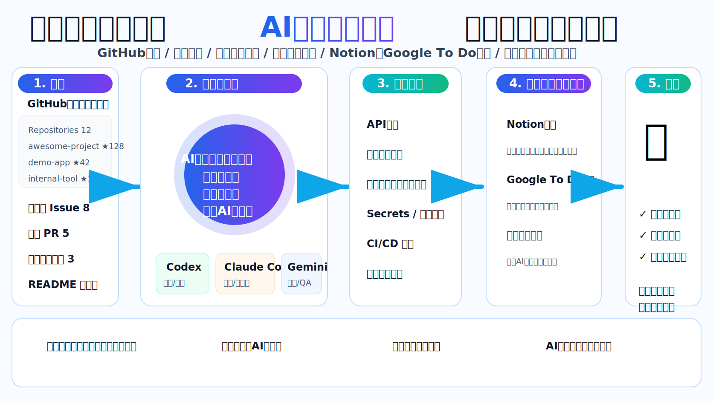
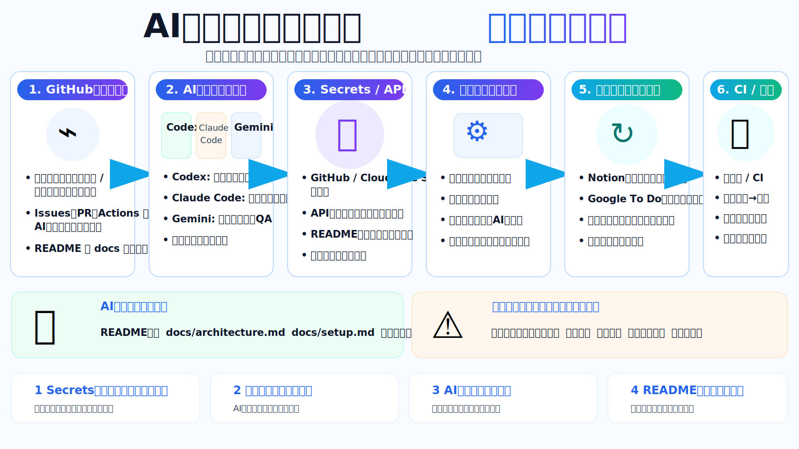
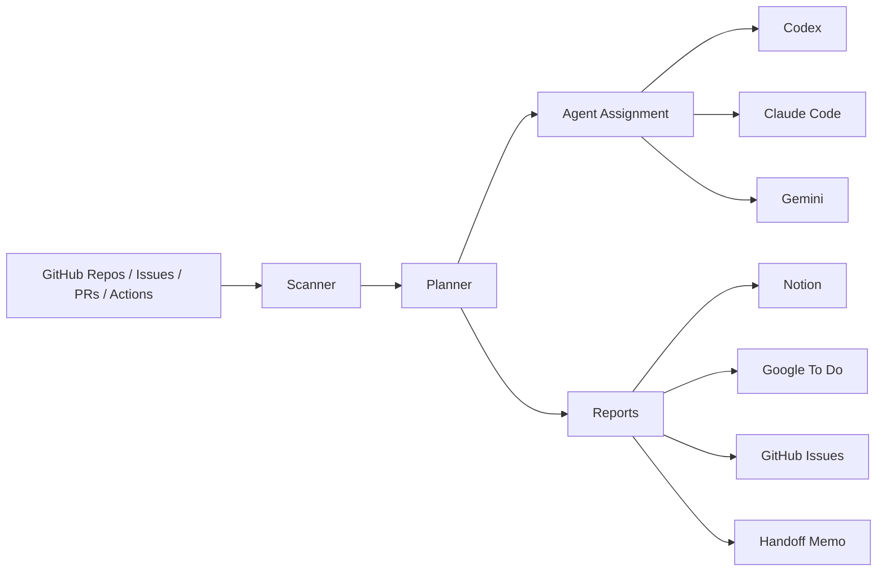

<p align="center">
  
</p>

# AI Agent Handoff Hub

止まっているGitHubリポジトリ、未完了Issue、放置PR、初期設定待ち、README未整備、CI失敗をAIエージェントが定期的に拾い、Codex / Claude Code / Gemini などの実行役へ渡せる形に分解し、Notion / Google To Do へ進捗を同期するための自動引き継ぎ基盤です。

このリポジトリは、最初から **README、docs、CI、テスト、devcontainer、定期実行Workflow、引き継ぎメモ、Secrets設計、成果物Artifact出力** まで入ります。人間が毎回確認ボタンを押す運用ではなく、AIが進められるところまで自動で進み、どうしても人間が必要な箇所だけを明示します。

<p align="center">
  
</p>

## 何を自動化するか

| 領域 | 自動化する内容 | 人間が必要になりやすい部分 |
|---|---|---|
| GitHub監視 | 対象リポジトリ、Issue、PR、Actions、README、docs、未完了タスクを検出 | private repoへの権限付与 |
| AI引き継ぎ | タスク理解、優先度付け、Codex / Claude Code / Gemini への役割割当 | 最終方針の変更判断 |
| 初期設定 | Secrets名の一覧化、設定不足検出、依存関係、CI/CD、docs整備 | APIキー発行、本人確認、二段階認証 |
| 進捗同期 | Notion、Google To Do、Markdown、JSON Artifactへ同期 | 外部サービス初回認可 |
| 本番準備 | テスト、CI、ビルド、失敗ログ解析、次アクション作成 | 最終承認、課金開始、規約同意 |

## 最初に使うコマンド

```bash
pip install -e '.[dev]'
python -m ai_agent_handoff_hub run-all --target-repos owner/repo --output-dir outputs --dry-run
pytest -q
```

GitHub Actionsからは `AI Agent Handoff Hub` workflowを手動実行するか、定期実行を有効化してください。成果物は `ai-agent-handoff-report` Artifact として保存されます。

## 推奨Secrets

| Secret名 | 用途 | 必須 |
|---|---|---|
| `GH_PAT` | 複数リポジトリを横断して読む/Issue作成するためのGitHub token | 推奨 |
| `NOTION_TOKEN` | Notion API連携 | 任意 |
| `NOTION_DATABASE_ID` | タスク同期先Notion DB | 任意 |
| `GOOGLE_TASKS_API_TOKEN` | Google Tasks API連携用アクセストークン | 任意 |
| `GOOGLE_TASKS_TASKLIST_ID` | Google To Do / Tasks の同期先リストID | 任意 |
| `GOOGLE_TASKS_WEBHOOK_URL` | Google Tasks連携を外部自動化に委譲する場合のWebhook | 任意 |

## 自動で残す成果物

- `outputs/handoff-report.json`: 検出結果、タスク、担当AI、優先度、人間が必要な理由
- `outputs/handoff-report.md`: AI同士が読みやすい引き継ぎメモ
- `outputs/notion-payload.json`: Notion同期用payload
- `outputs/google-tasks-payload.json`: Google To Do同期用payload
- `outputs/agent-commands.md`: Codex / Claude Code / Gemini に渡す実行指示

## AI実行役の基本方針

| Agent | 担当 | 例 |
|---|---|---|
| Codex | 実装、修正、テスト、CI失敗修正 | failing workflow、バグ修正、テスト追加 |
| Claude Code | 設計、整理、ドキュメント、要件分解 | README、setup.md、architecture.md、初期設定手順 |
| Gemini | 調査、検証、QA、比較 | 外部API調査、ログ検証、再現確認 |

## アーキテクチャ



詳細は [`docs/architecture.md`](docs/architecture.md) と [`docs/setup.md`](docs/setup.md) を見てください。
