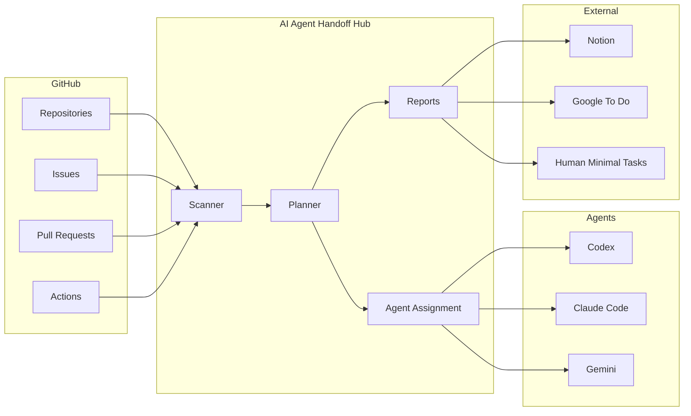
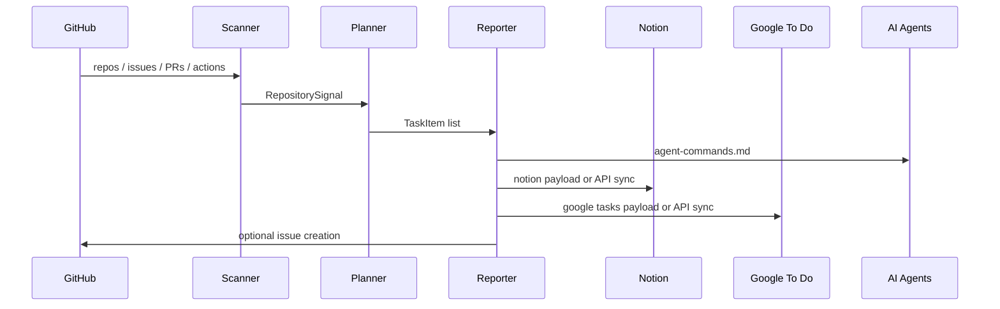

# Architecture

AI Agent Handoff Hub は、止まっている開発を検出し、AIが引き継げる単位へ変換し、外部タスク管理へ同期するための軽量な自動化レイヤーです。

## 全体像

## コンポーネント

### Scanner

`src/ai_agent_handoff_hub/scanner.py` がGitHub APIから以下を読みます。

- READMEの有無
- docsフォルダの有無
- open Issue / PR
- 更新が止まっているIssue / PR
- GitHub Actionsの失敗履歴
- 初期設定、API、Secrets、認証、デプロイ関連のキーワード

### Planner

`src/ai_agent_handoff_hub/planner.py` が検出結果をAI実行可能なタスクへ変換します。

- 実装・修正・CI失敗: Codex
- 設計・docs・初期設定整理: Claude Code
- 調査・検証・QA: Gemini
- 本人確認、権限付与、課金開始、規約同意: Human

### Reports

`src/ai_agent_handoff_hub/reporting.py` が以下を生成します。

- `handoff-report.json`
- `handoff-report.md`
- `agent-commands.md`
- `notion-payload.json`
- `google-tasks-payload.json`

### Integrations

Notion / Google To Do は、Secretsがある場合だけ同期します。Secretsがない場合でもpayloadは生成されるため、次のAIまたは人間がどこから再開すべきかが明確になります。

## データフロー

## Secrets設計

実値はコードに書きません。READMEとdocsにはSecret名のみを残します。

- `GH_PAT`
- `NOTION_TOKEN`
- `NOTION_DATABASE_ID`
- `GOOGLE_TASKS_API_TOKEN`
- `GOOGLE_TASKS_TASKLIST_ID`
- `GOOGLE_TASKS_WEBHOOK_URL`
- `CODEX_COMMAND`
- `CLAUDE_CODE_COMMAND`
- `GEMINI_COMMAND`

## 本番実行に必要なもの

最小構成ではGitHub Actionsの標準 `GITHUB_TOKEN` だけで現在のリポジトリをスキャンできます。複数リポジトリ横断、Issue作成、private repo監視には `GH_PAT` を設定してください。

Notion / Google To Do への実同期には、それぞれのAPI認可が必要です。認可がない場合も、payloadと引き継ぎメモはArtifactとして残ります。
